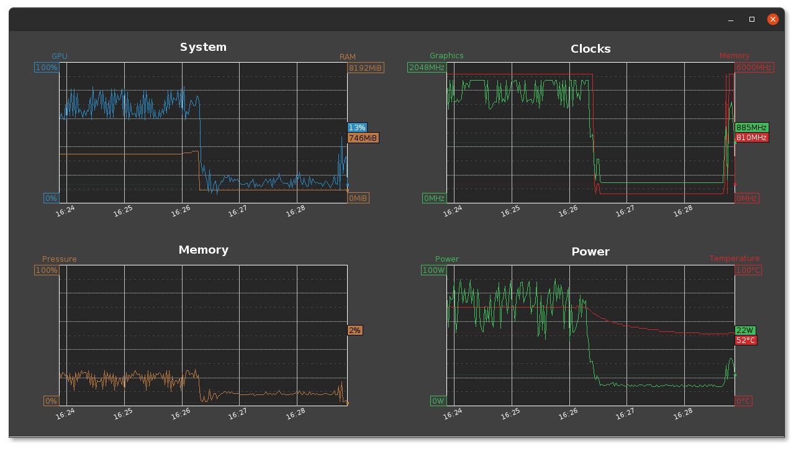
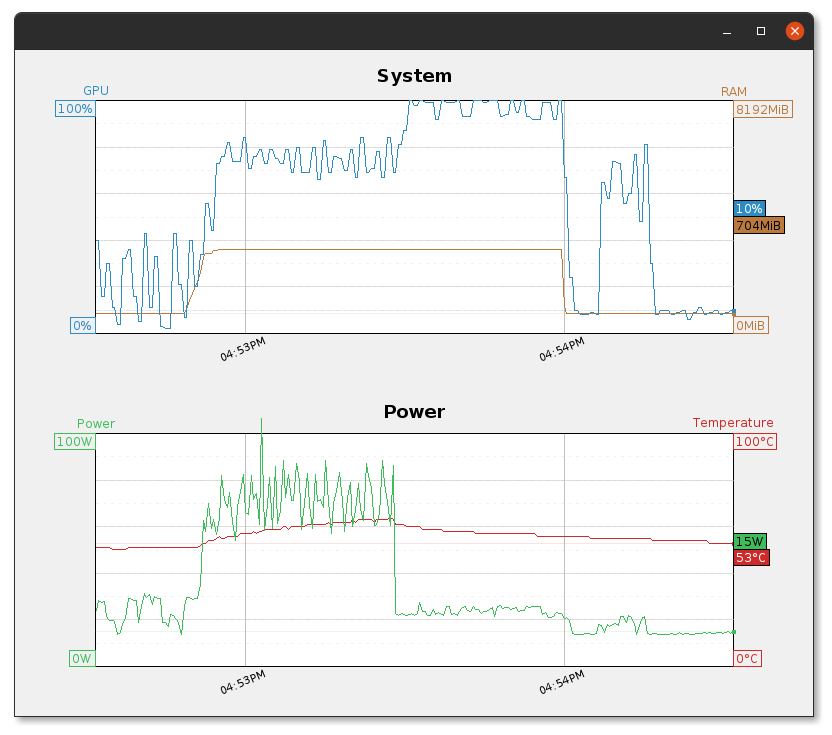
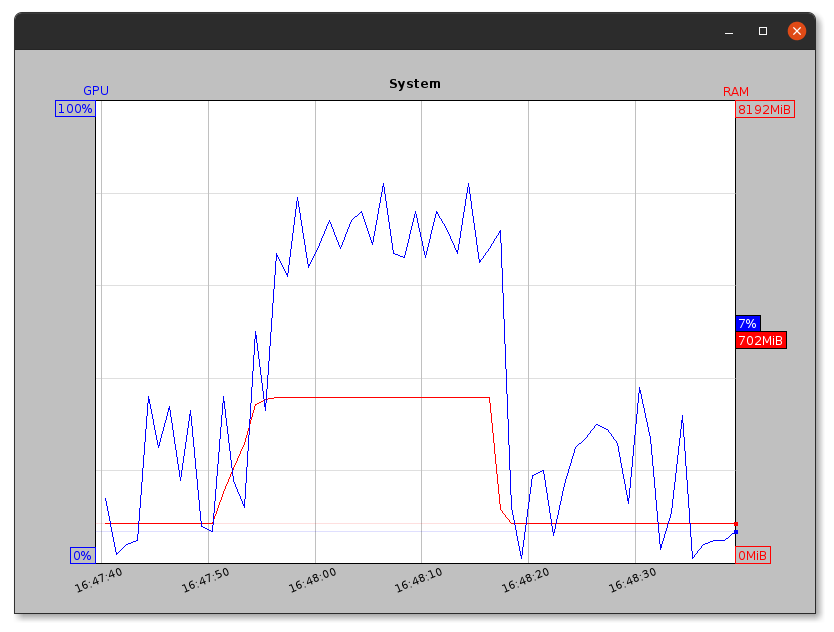

# Java NVTop

"Overly-configurable" GUI Java frontend to `nvidia-smi` for those (like me) who can't install NVidia's `nvtop`
(e.g. with error `nvtop : Depends: libnvidia-compute-418 but it is not going to be installed`).



It will spawn an `nvidia-smi` process, leveraging the `--query-gpu=...` and `--loop-ms=...` parameters to parse its ouput to nicer, customizable graphs.

It is configurable through an `nvtop.properties` file to spawn graphs and map specific GPU queries to graphs (up to 2 queries per graph: one left and one right).

The release contains a runnable jar compatible with Java 14 and up. Note that the code itself is just 5 files and doesn't use fancy features above Java 8 so it could be easily recompiled for Java 8.

## Configuration

The `nvtop.properties` file contains the whole configuration.

### Common parameters

| Property | Description |
|---|---|
| `graph.duration` | The total graphed time, in seconds, from right (most recent measures) to left (oldest measures). |
| `graph.refresh` | Trigger a measure every number of millisecond. |
| `graph.ticks.time` | If > 0, display timestamp ticks on the graph every number of seconds, with corresponding timestamp text |
| `graph.ticks.time.format` | The time format to display timestamp. It follows [Java `SimpleDateFormat`](https://docs.oracle.com/javase/8/docs/api/java/text/SimpleDateFormat.html) format.<br>E.g. `HH:mm:ss` to display `14:33:31` or `HH:mma` to display `2:33PM`. |
| `graph.ticks.majors` | Number of major divisions on the Y axis (e.g. `5` will divide into 5 sections, 20% each).<br>Lines will be plain. |
| `graph.ticks.minors` | Number of minor divisions on the Y axis. Should be greater than majors (e.g. `10` will divide into 10 sections, 10% each).<br>Lines will be dashed. |
| `graph.background.panel` | Background color of all graphs' outside area (the window background basically). |
| `graph.title.font` | The font for all graphs titles, as per Java [`Font.decode()`](https://docs.oracle.com/javase/8/docs/api/java/awt/Font.html#decode-java.lang.String-) format. |
| `graph.grid` | All graphs are positioned on a grid with this many rows and columns. Format is `<rows>,<columns>` (e.g. `3,2` to display 3 rows and 2 columns). |

### Default parameters

| Property | Description |
|---|---|
| `graph.ticks.color` | Default tick lines color, as per Java [`Color.decode()`](https://docs.oracle.com/javase/8/docs/api/java/awt/Color.html#decode-java.lang.String-) format.<br>E.g. `#ff0000` is pure red. |
| `graph.background` | Background color for the graphing area. |

### Graph panels configuration

Graph panels are defined by series of `graph.<n>.xxx` properties.

| Property | Description |
|---|---|
| `graph.<n>.title` | Graph title, displayed on top. |
| `graph.<n>.background` | Background color for the graphing area. Overrides the default `graph.background` property. |
| `graph.<n>.ticks.color` | Tick lines color. Overrides the default `graph.ticks.color` property. |

Graph panels can display two graphs: left and right, that are configured through the `graph.<n>.<left|right>.xxx` properties.
A panel doesn't need to specify *both* `left` or `right` (hereafter refered to as `pos`), but at least one (obviously).

| Property | Description |
|---|---|
| `graph.<n>.<pos>.query` | GPU query to graph (see ["GPU queries"](#gpu-queries) below). |
| `graph.<n>.<pos>.title` | Name of the series. |
| `graph.<n>.<pos>.min` | Minimum value for the series. |
| `graph.<n>.<pos>.max` | Maximum value for the series. |
| `graph.<n>.<pos>.unit` | Unit for the value. |
| `graph.<n>.<pos>.color` | Color used to draw the series. |

So you can configure either a dark theme (as above) or a light one:



## Default configuration

If no `nvtop.properties` file is found in the working directory, a default one will be created with a single graph showing GPU and memory usage for 1 minute, refreshing every second:



```
graph.refresh=1000
graph.duration=60
graph.1.title=System
graph.1.left.title=GPU
graph.1.left.query=utilization.gpu
graph.1.left.min=0
graph.1.left.max=100
graph.1.left.unit=%
graph.1.right.title=RAM
graph.1.right.query=memory.used
graph.1.right.min=0
graph.1.right.max=8192
graph.1.right.unit=MiB
```

## GPU queries

First, run the following command line to get the list of available queries for your system (note to Windows users, you might need to [add `nvidia-smi.exe` directory to Windows `%PATH%`](https://stackoverflow.com/a/57100016/1098603):
```
nvidia-smi --help-query-gpu
```
That will show you the list of supported queries you can try to graph. N.B. that not all of them actually return values, it depends on the NVidia drivers, so it is better to test the output to make sure you don't have any `N/A` values so you know which query will work and which won't:
```
$ nvidia-smi --format=csv,noheader,nounits --loop-ms=1000 --query-gpu=timestamp,utilization.gpu,utilization.memory,memory.used,fan.speed
2021/09/06 15:31:25.590, 82, 14, 2890, [N/A]
2021/09/06 15:31:26.591, 64, 24, 2890, [N/A]
2021/09/06 15:31:27.592, 71, 24, 2890, [N/A]
```
(here `fan.speed` is not usable).
